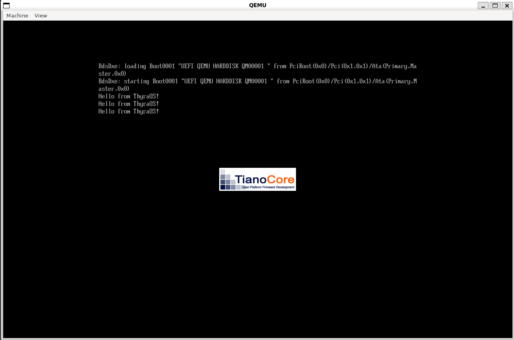

# ThyraOS UEFI Application

<div align="center"> 
    
   <br>
   <br>
   <b>ThyraOS currently starts as a simple UEFI application for testing low-level concepts, with plans to evolve into a bootloader and basic kernel.</b>
</div>

<br>

## Build Instructions

### Build Dependencies
- **clang++ 18.0**
- **lld-link 18.0**
- **cmake 4.2**

### Script Dependencies
- **QEMU** (x86_64 target)
- **mtools** (for FAT image creation)
- **OVMF** (UEFI firmware files)
  
---

## Usage

### Building
```
git clone https://github.com/TheColGateMann4/ThyraOS.git
cd ThyraOS
rm -r build
cmake --preset debug
cmake --build --preset debug
```

### Running
```
./scripts/run -debug
```

---

### Structure

```
scripts/          # Scripts for faster workflow
src/              # Source code
├─ bootloader/    # Bootloader source
```
